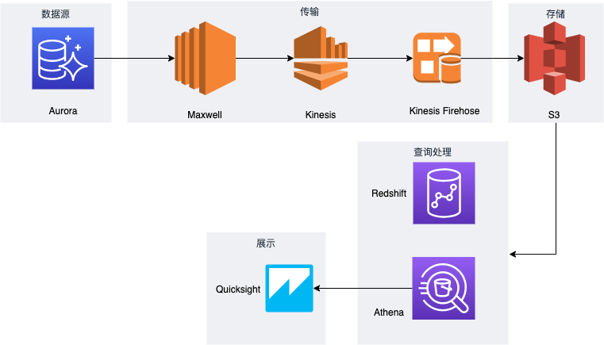

# 以Aurora数据库作为数据源的大数据抽取方案

## 方案默认在us-east-1 region实现，如果要在其他region操作也可以，但是需要注意一些指令中需要指定参数

## 方案概述
- 本方案会以Aurora作为数据源，展示了通过binlog读取的方式传输并存储到，并在存储后通过数仓技术查询处理以及BI工具展示处理后的数据。方案的架构图如下所示



- 本方案会以Aurora作为数据源，通过开启binlog后，以maxwell读取binlog数据，打到aws kinesis流式处理，并通过kinesis firehose作为缓冲，最终写入s3，数据最终存储后，通过Athena或者Redshift做查询处理，并以quicksight来展示
- 本方案中涉及的内容会以 *数据源，数据抽取，数据存储，数据查询处理，数据展示* 几个部分
- 方案中 * 数据源，数据抽取，数据存储* 其他说明可以参考此博客 [利用MySQL Binlog实现流式实时分析架构](https://aws.amazon.com/cn/blogs/china/mysql-binlog-architecture/)
### 数据源
数据库作为数据源，只需要开启binlog，在Aurora，binlog默认不开启，开启需要修改参数组，并且需要把binglog_format设置为Row
另外，我们可以利用AWS RDS提供的存储过程，实现调整Binlog在RDS的存储时间为24个小时。
```
call mysql.rds_set_configuration('binlog retention hours', 24)
```

### 数据抽取
数据抽取使用maxwell，而消费maxwell的选择有很多，参考此文档可以看到maxwell支持的下游对接工具 [maxwell quick start](https://maxwells-daemon.io/quickstart/)

在本次方案中，我们选择完全托管的kinesis来传输，Lambda实时处理数据，接着通过kinesis firehose作为缓冲流数据
启动指令如下，注意修改数据库相关参数：
```
docker run -it --rm --name maxwell -v `cd && pwd`/.aws:/root/.aws zendesk/maxwell sh -c 'cp /app/kinesis-producer-library.properties.example /app/kinesis-producer-library.properties && echo "Region=$AWS_DEFAULT_REGION" >> /app/kinesis-producer-library.properties && bin/maxwell --user=$MYSQL_USERNAME --password=$MYSQL_PASSWORD --host=$MYSQL_HOST --producer=kinesis --kinesis_stream=$KINESIS_STREAM'
```

kinesis firehose的配置依然参考[利用MySQL Binlog实现流式实时分析架构](https://aws.amazon.com/cn/blogs/china/mysql-binlog-architecture/) 中的 3，5，6 配置把数据打入s3

### 数据存储
数据库的数据存储在s3后，我们可以灵活利用各种计算服务（EMR，Redshift，Athena）等对s3的数据做处理，查询。
另外还可以有其他的不同数据源，比如各种应用，服务的日志。数据库的历史数据，爬虫数据，都可以通过各种方式存储到s3


### 数据查询处理
本次实验的数据查询处理使用Athena和Redshift，因为需要一些数据，实验中需要从其他地方获取一些数据来演示，需要先执行以下指令来获取数据
通过执行以下指令获取数据，注意请先创建你自己的s3存储桶，然后替换以下命令中的存储桶名字为你自己的。

```
aws s3 cp s3://stock-public-data/stock_day.csv s3://{YOURBUCKETNAME}/raw/stock_day.csv --request-payer requester --region us-east-1
```


在开始使用 Athena 之前，请先导航到 Glue 控制台：[https://console.aws.amazon.com/glue/home?region=us-east-1](https://console.aws.amazon.com/glue/home?region=us-east-1)

- 在控制台中点击左侧 **Databases**，然后在右侧页面点击 **Add database**：


- 添加一个名为 **stock-data** 的数据库：

接下来可以前往 Athena 控制台进行操作：[https://console.aws.amazon.com/athena/home?region=us-east-1#](https://console.aws.amazon.com/athena/home?region=us-east-1#)

- 使用Athena前，必须设置查询结果的地址，如图示，在s3下新建一个目录。在Athena右上方点击Settings，并选中这个路径：


- 请确保左侧的 **Database** 选项中选中的是刚刚创建的 **stock-data** 数据库，而并非 default 或其他数据库
- 创建原始数据表的 SQL 语句（需要将 algo-trading-workshop-xxx 修改为您自定义的存储桶名）：
```
CREATE EXTERNAL TABLE IF NOT EXISTS stock_day_raw (
  ticker string,
  secID string,
  tradeDate string,
  openPrice double,
  highestPrice double,
  lowestPrice double,
  closePrice double,
  turnoverVol double,
  turnoverValue double,
  accumAdjFactor double,
  isOpen boolean
)
ROW FORMAT SERDE 'org.apache.hadoop.hive.serde2.OpenCSVSerde'
LOCATION 's3://algo-trading-workshop-xxx/raw'
TBLPROPERTIES ('skip.header.line.count'='1');
```

- 输入上方 SQL 语句，**Run query**，可以看到左侧新生成的 **stock_day_raw**：


- 再输入创建新 Parquet 表的 SQL 语句（需要将 algo-trading-workshop-xxx 修改为您自定义的存储桶名）：
```
CREATE EXTERNAL TABLE IF NOT EXISTS stock_day (
  ticker string,
  secID string,
  tradedate string,
  openPrice double,
  highestPrice double,
  lowestPrice double,
  closePrice double,
  turnoverVol double,
  turnoverValue double,
  accumAdjFactor double,
  isOpen boolean
)
STORED AS parquet
LOCATION 's3://algo-trading-workshop-xxx/parquet'
```

- 再点击 **Run query**，可以看到左侧新生成的 **stock_day** 数据表


- 刚生产的 stock_day 表现在还是空的。接下来我们执行 SQL 语句将原始表的数据导入到新表：
```
INSERT INTO stock_day
SELECT *
FROM stock_day_raw;
```

语句执行完成之后，应该也可以在 **s3://algo-trading-workshop-xxx/parquet** 下看到生成的数据：

